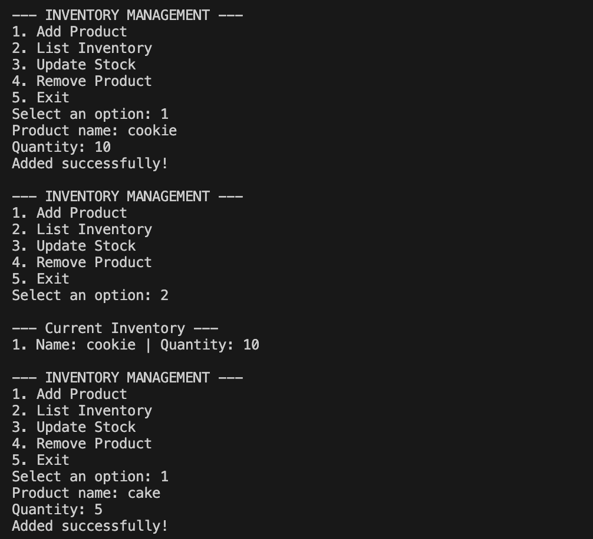

# Inventory Management System (C#)

This is a professional console-based application developed as part of the "Introduction to Programming with C#" course. The project focuses on core programming logic, data manipulation, and clean code practices without the use of Object-Oriented Programming (OOP).

## 🚀 Project Overview
This application allows users to manage a product inventory through a command-line interface. It demonstrates the use of parallel collections to track product names and their respective quantities.

## 🛠️ Key Features
- **Add Products:** Register new items with their current stock levels.
- **List Inventory:** Display all products currently stored in the system.
- **Update Stock:** Search for an existing product and modify its quantity.
- **Remove Products:** Delete items from the inventory system.
- **Data Validation:** Prevents invalid inputs (like negative numbers or text in numeric fields).

## 💻 Technical Concepts Applied
- **Control Structures:** `switch` statements for navigation and `if-else` for input validation.
- **Loops:** `while` for the main application lifecycle and `for` loops for list traversal.
- **Collections:** Use of `List<T>` for dynamic data management.
- **Modularization:** Code organized into specific, reusable static methods.

## ⚙️ How to Run the Project

### Prerequisites
- [.NET SDK](https://dotnet.microsoft.com/download) installed on your machine.

### Steps to Run
1. **Clone the repository:**
   ```bash
   git clone [https://github.com/YOUR_USERNAME/InventoryManagementCS.git](https://github.com/YOUR_USERNAME/InventoryManagementCS.git)

2. **Navigate to the project folder:**
```bash
cd InventoryManagementCS

3. **Execute the application:**
```bash
dotnet run

📝 License
This project was developed for educational purposes as part of a Coursera specialization.

## Preview
